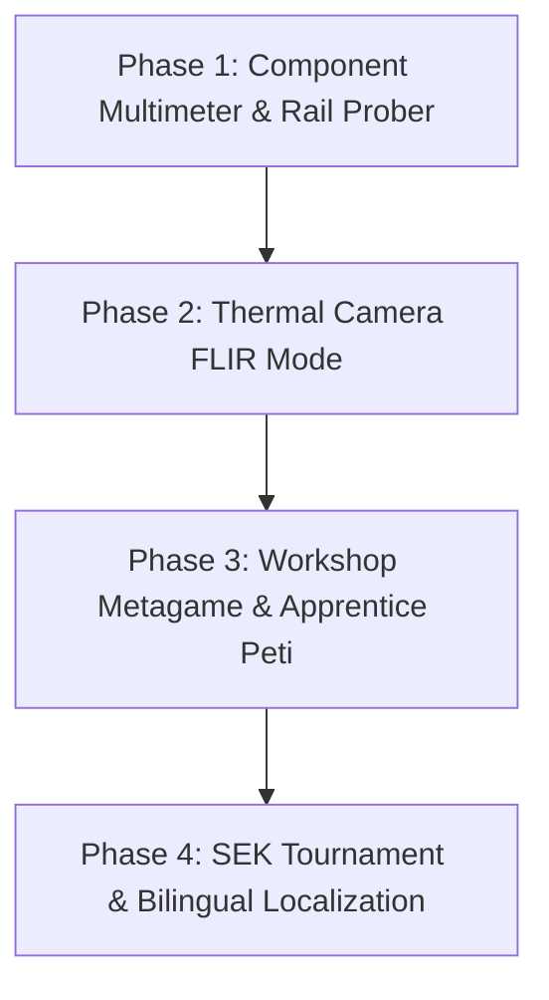

# TechOps Budapest · Master System Audit, Architecture Invariants & Evolution Blueprint

**Target Project**: [`materials/techops/`](file:///Users/marktremmel/PracticeSheetsCombined_AntiGravity%20NonLameActually_claudeFinAntigravWhatevs/materials/techops/) (TechOps Budapest — Repair Shop Simulator)  
**Authors**: Antigravity Project Lead (incorporating Claude's Foundation Roadmap & Invariants)  
**Status**: Investigation & Architectural Master Specification (Pre-Implementation Phase)  
**Primary Engine File**: [`materials/techops/index.html`](file:///Users/marktremmel/PracticeSheetsCombined_AntiGravity%20NonLameActually_claudeFinAntigravWhatevs/materials/techops/index.html)  

---

## Executive Summary & Educational Philosophy

**TechOps Budapest** is a high-fidelity, tactile, and consequential IT repair simulation designed for secondary education (Grades 5–12). Rather than relying on multiple-choice quizzes or sterile worksheets, it places students at the service counter and workbench of a Budapest repair shop, teaching empirical troubleshooting, systems thinking, digital economics, and consumer ethics.

```
+-----------------------------------------------------------------------------+
|                          TECHOPS BUDAPEST ARCHITECTURE                      |
+-----------------------------------------------------------------------------+
|                                                                             |
|   1. COUNTER INTAKE            2. EMPIRICAL DIAGNOSIS   3. THE WORKBENCH    |
|   - Customer Narrative         - Hardware Instruments   - Teardown Sequence |
|   - Symptom vs Cause           - macOS Diagnostic Lab   - Precision Gestures|
|   - Working Theory Log         - Zero Guesswork Metric  - Component Bays    |
|                                                                             |
|   4. LOCAL PARTS MARKET        5. ETHICAL HANDOVER      6. ASSESSMENT       |
|   - HardverApró (Used / Risk)  - 5 Judgement Axes       - SEK7K- Codes      |
|   - iPon (Retail / Warranty)   - Star-Rating Caps       - Class Dashboard   |
|   - SZ-Direct (Shenzhen / Delay- Anti-Upselling Engine  - Zero-GDPR Serverless
+-----------------------------------------------------------------------------+
```

### The Seven Inviolable Invariants (Claude's Rules that Hold it Together)

Any modification or expansion must respect these fundamental simulation rules:

1. **Money Buys Time, Never Score**: Shop upgrades ([`data-upgrades.js`](file:///Users/marktremmel/PracticeSheetsCombined_AntiGravity%20NonLameActually_claudeFinAntigravWhatevs/materials/techops/js/data-upgrades.js)) reduce bench hours, parts delivery days, and increase customer footfall. *Not one upgrade directly alters the five judgement axes.* A fully upgraded shop that fits the wrong component still receives a 2-star rating.
2. **A Job is Only as Good as its Worst Axis**: In [`sim-score.js`](file:///Users/marktremmel/PracticeSheetsCombined_AntiGravity%20NonLameActually_claudeFinAntigravWhatevs/materials/techops/js/sim-score.js), a strict cap is placed on the final star rating whenever any single axis (Fit, Budget, Speed, Durability, Safety) drops. A repair delivered three weeks late or wildly over-budget cannot average out to five stars.
3. **Zero-Part Faults Must Remain Central**: Problems like `disk_full`, `port_lint`, `runaway_process`, `sd_formatted`, `os_wrecked`, `no_internet`, `dead_no_power`, `smc_confused`, and `locked_out` require *no new hardware* (`noPartNeeded: true`). Selling parts for these is flagged as an ethical violation (`soldUnneeded`) and severely penalized.
4. **Asking Beats Testing**: An intake question costs 0.1 h bench time; running an instrument (e.g. `memtest`) costs 1.5 h. Sharp questions reveal decisive clues (`w: 'hot'`) that narrow down which instrument to pick, preventing brute-force testing.
5. **Bench Hours are Days**: `benchDays = Math.ceil(labourHours / 6)`. Lateness is calculated relative to what was *promised* to the customer, not absolute elapsed calendar days.
6. **Failure is Never a Dead End**: Botched precision gestures (e.g., snapping an adhesive tab, rounding a screw) cost extra bench time or force the technician onto a slower recovery route (e.g. prying with a spudger, using an extractor), but *never soft-lock or strand the player*.
7. **Every Refusal Announces Itself**: A blocked action must trigger both an interactive toast notification and an informative descriptive label on the control before it is clicked. Silent no-ops are prohibited.

---

## Part 1: Comprehensive Bug & Inconsistency Audit (13 Identified Issues)

Below is the complete catalog of 13 verified bugs, logic traps, and missing connections in the current codebase.

---

### Bug 1: Missing Console & Handheld Chassis Layouts on Workbench
- **Files**: [`board.js:L105-113`](file:///Users/marktremmel/PracticeSheetsCombined_AntiGravity%20NonLameActually_claudeFinAntigravWhatevs/materials/techops/js/board.js#L105-L113) & [`data-machines.js`](file:///Users/marktremmel/PracticeSheetsCombined_AntiGravity%20NonLameActually_claudeFinAntigravWhatevs/materials/techops/js/data-machines.js)
- **Classification**: Critical Visual & Functional Glitch.
- **Root Cause**: `KIND_FOR` maps machine kinds to visual chassis layouts:
  ```javascript
  var KIND_FOR = {
    laptop: 'laptop_classic', desktop: 'desktop', phone: 'phone', tablet: 'tablet', aio: 'aio'
  };
  ```
  `'console'` (`ps5pro`) and `'handheld'` (`steamdeck`, `switch2`) are omitted. When a PS5 Pro or Steam Deck is opened on the workbench, it falls back to `laptop_classic`, drawing a 3-cell laptop battery pack and display ribbon cable on a gaming console! Furthermore, console teardown steps (`psu_switch`, `cooler`, `cpu`) have no target regions in `laptop_classic`, causing clicks to fail.
- **Suggested Fix**:
  Map `console` and `handheld` in `KIND_FOR`:
  ```javascript
  var KIND_FOR = {
    laptop: 'laptop_classic', desktop: 'desktop', phone: 'phone',
    tablet: 'tablet', aio: 'aio', console: 'console', handheld: 'handheld'
  };
  ```
  Add dedicated console and handheld layouts to `LAYOUTS` in [`board.js`](file:///Users/marktremmel/PracticeSheetsCombined_AntiGravity%20NonLameActually_claudeFinAntigravWhatevs/materials/techops/js/board.js), or alias them to `desktop` and `tablet` until custom vector artwork is loaded.

---

### Bug 2: Missing `openStepId` Case for Consoles
- **File**: [`ui-bench.js:L70-75`](file:///Users/marktremmel/PracticeSheetsCombined_AntiGravity%20NonLameActually_claudeFinAntigravWhatevs/materials/techops/js/ui-bench.js#L70-L75)
- **Classification**: Teardown State Lock.
- **Root Cause**:
  ```javascript
  function openStepId(machine) {
    if (machine.kind === 'desktop') return 'side_panel';
    if (machine.kind === 'aio' || machine.kind === 'tablet') return 'lift_display';
    if (machine.kind === 'phone') return 'screen_lift';
    return 'bottom_case';
  }
  ```
  For `ps5pro` (`machine.kind === 'console'`), `openStepId` returns `'bottom_case'`. However, `ps5pro.teardown` in [`data-machines.js:L257`](file:///Users/marktremmel/PracticeSheetsCombined_AntiGravity%20NonLameActually_claudeFinAntigravWhatevs/materials/techops/js/data-machines.js#L257) uses `'side_panel'`. The mismatch prevents the workbench from recognizing when the chassis has been opened.
- **Suggested Fix**:
  ```javascript
  function openStepId(machine) {
    if (machine.kind === 'desktop' || machine.kind === 'console') return 'side_panel';
    if (machine.kind === 'aio' || machine.kind === 'tablet') return 'lift_display';
    if (machine.kind === 'phone') return 'screen_lift';
    return 'bottom_case';
  }
  ```

---

### Bug 3: Teardown Step "cpu" vs Region "die" Mismatch on Desktop
- **Files**: [`data-machines.js:L102`](file:///Users/marktremmel/PracticeSheetsCombined_AntiGravity%20NonLameActually_claudeFinAntigravWhatevs/materials/techops/js/data-machines.js#L102), [`board.js:L57`](file:///Users/marktremmel/PracticeSheetsCombined_AntiGravity%20NonLameActually_claudeFinAntigravWhatevs/materials/techops/js/board.js#L57), and [`ui-bench.js:L138-148`](file:///Users/marktremmel/PracticeSheetsCombined_AntiGravity%20NonLameActually_claudeFinAntigravWhatevs/materials/techops/js/ui-bench.js#L138-L148)
- **Classification**: Non-Clickable Teardown Region.
- **Root Cause**: `tower_pc.teardown` specifies `['psu_switch', 'side_panel', 'drive_bay', 'ram_bay', 'cooler', 'cpu']`. In `board.js`, the desktop socket region is named `die`. In `ui-bench.js`, `REGION_CHIP` defines mappings for `cooler` and `heatsink`, but completely lacks `cpu` and `psu_switch`. Hence, `chipForRegion(m, 'cpu')` returns `null`, stranding the CPU step.
- **Suggested Fix**:
  Add `cpu` and `psu_switch` to `REGION_CHIP` in [`ui-bench.js`](file:///Users/marktremmel/PracticeSheetsCombined_AntiGravity%20NonLameActually_claudeFinAntigravWhatevs/materials/techops/js/ui-bench.js):
  ```javascript
  cpu:        ['socket', 'cpu', 'apu', 'soc', 'die'],
  psu_switch: ['atx24', 'io', 'vrm'],
  ```

---

### Bug 4: Warranty Comeback Fallback Bug on Mobile Devices
- **File**: [`ui-handover.js:L82-89`](file:///Users/marktremmel/PracticeSheetsCombined_AntiGravity%20NonLameActually_claudeFinAntigravWhatevs/materials/techops/js/ui-handover.js#L82-89)
- **Classification**: Impossible Ticket Generation.
- **Root Cause**:
  ```javascript
  function comebackFault(cat, t) {
    var map = { storage: 'dying_hdd', ram: 'bad_ram_stick', battery: 'battery_swollen',
                screen: 'cracked_screen', fan: 'fan_seized', thermal: 'thermal_paste_dead', flex: 'port_lint' };
    var id = map[cat] || 'thermal_paste_dead';
    var m = J.machine(t);
    var f = window.TechOpsFaults.get(id);
    return (f && f.appliesTo.indexOf(m.id) !== -1) ? id : 'thermal_paste_dead';
  }
  ```
  If an `iphone12`, `iphone17`, or `ipad_air` experiences a comeback in an unmapped category (or if `f.appliesTo` does not match), it unconditionally falls back to `'thermal_paste_dead'`. However, `thermal_paste_dead.appliesTo` only applies to computers with heatsinks; iPhones do not use thermal paste. This spawns an unwinnable ticket where no thermal paste can be purchased or applied.
- **Suggested Fix**:
  Fallback dynamically to a fault valid for that machine:
  ```javascript
  function comebackFault(cat, t) {
    var map = { storage: 'dying_hdd', ram: 'bad_ram_stick', battery: 'battery_swollen',
                screen: 'cracked_screen', fan: 'fan_seized', thermal: 'thermal_paste_dead', flex: 'port_lint' };
    var id = map[cat] || 'thermal_paste_dead';
    var m = J.machine(t);
    var f = window.TechOpsFaults.get(id);
    if (f && f.appliesTo.indexOf(m.id) !== -1) return id;
    var machineFaults = window.TechOpsFaults.forMachine(m);
    return machineFaults.length ? machineFaults[0].id : 'port_lint';
  }
  ```

---

### Bug 5: Double-Escaped Unicode Literal in `ui-shopfit.js`
- **File**: [`ui-shopfit.js:L59`](file:///Users/marktremmel/PracticeSheetsCombined_AntiGravity%20NonLameActually_claudeFinAntigravWhatevs/materials/techops/js/ui-shopfit.js#L59)
- **Classification**: Visual Typography Defect.
- **Root Cause**:
  ```javascript
  + '<p>Everything you earn beyond the parts bill ends up here. None of it buys a better review \\u2014 '
  ```
  The double backslash causes JavaScript to output raw string literal `\u2014` in the browser instead of the em-dash `—`.
- **Suggested Fix**:
  Replace `\\u2014` with standard unicode `\u2014` or `—`.

---

### Bug 6: Offline File Protocol (`file://`) CORS Failure on JSON Assets
- **Files**: [`ui-chipid.js:L26`](file:///Users/marktremmel/PracticeSheetsCombined_AntiGravity%20NonLameActually_claudeFinAntigravWhatevs/materials/techops/js/ui-chipid.js#L26) & [`pixel-portrait.js:L36`](file:///Users/marktremmel/PracticeSheetsCombined_AntiGravity%20NonLameActually_claudeFinAntigravWhatevs/materials/techops/js/pixel-portrait.js#L36)
- **Classification**: Offline Classroom Breakdown.
- **Root Cause**: `ui-chipid.js` and `pixel-portrait.js` load `js/chipid-data.json` and `js/pixel-manifest.json` using `fetch()`. In school labs where students open `file:///.../index.html` directly from a USB stick without running a local web server, Chrome, Safari, and Edge block the request under strict null-origin CORS policies.
- **Suggested Fix**:
  Provide an inline/global JavaScript fallback wrapper (e.g. `chipid-data.js` setting `window.TechOpsChipData = {...}`) so `fetch` is only used if the global constant is absent:
  ```javascript
  if (window.TechOpsChipData) return Promise.resolve(window.TechOpsChipData);
  return fetch('js/chipid-data.json?...').then(...);
  ```

---

### Bug 7: Portfolio Site Navigation Disconnect
- **Files**: Root [`index.html:L293`](file:///Users/marktremmel/PracticeSheetsCombined_AntiGravity%20NonLameActually_claudeFinAntigravWhatevs/index.html#L293) and [`materials/field-guide.html`](file:///Users/marktremmel/PracticeSheetsCombined_AntiGravity%20NonLameActually_claudeFinAntigravWhatevs/materials/field-guide.html)
- **Classification**: Dead / Obsolete Navigation Link.
- **Root Cause**: Line 293 of the repository root `index.html` links to `materials/field-guide/index.html` (the old prototype). `materials/field-guide.html` redirects to `field-guide/index.html`. Neither connects to `materials/techops/index.html`, making the modern game completely unreachable from the main showcase page!
- **Suggested Fix**:
  Update root `index.html` card link to point directly to `materials/techops/index.html`.

---

### Bug 8: Severe Fault Distribution Imbalance Across Devices
- **File**: [`data-faults.js`](file:///Users/marktremmel/PracticeSheetsCombined_AntiGravity%20NonLameActually_claudeFinAntigravWhatevs/materials/techops/js/data-faults.js)
- **Classification**: Simulation Replayability Deficiency.
- **Root Cause**:
  - `ps5pro`: only **2 faults** (`thermal_paste_dead`, `fan_seized`).
  - `tower_pc`: only **5 faults**.
  - `iphone17`: only **4 faults**.
  - `iphone12`: only **5 faults**.
  Meanwhile, `mbp13_2012` has **20 faults** and `inspiron15` has **18 faults**.
- **Suggested Fix**: Expand `appliesTo` arrays: add `dead_no_power` and `water_damage` to `tower_pc` and `ps5pro`; add `cracked_screen` to `iphone17`.

---

### Bug 9 [NEW]: The Screw Head Visual Trap — Torx T3 and Torx T8 Render as Phillips
- **Files**: [`screw-heads.js:L37-43, L87`](file:///Users/marktremmel/PracticeSheetsCombined_AntiGravity%20NonLameActually_claudeFinAntigravWhatevs/materials/techops/js/screw-heads.js#L37-L43) & [`data-machines.js:L187, L253`](file:///Users/marktremmel/PracticeSheetsCombined_AntiGravity%20NonLameActually_claudeFinAntigravWhatevs/materials/techops/js/data-machines.js#L187)
- **Classification**: Unfair Pedagogical Penalty.
- **Root Cause**: In [`screw-heads.js`](file:///Users/marktremmel/PracticeSheetsCombined_AntiGravity%20NonLameActually_claudeFinAntigravWhatevs/materials/techops/js/screw-heads.js), `HEADS` maps:
  ```javascript
  var HEADS = {
    'phillips-00': phillips, 'phillips-0': phillips, 'phillips-1': phillips,
    'torx-t5': torx, 'torx-t6': torx, 'torx-t20': torx,
    'pentalobe-p2': pentalobe, 'pentalobe-p5': pentalobe,
    'tripoint-y000': tripoint
  };
  ```
  `torx-t3` (used on MacBook Pro 14" M3) and `torx-t8` (used on PS5 Pro) are **omitted from `HEADS`**.  
  Line 87 specifies the fallback:
  ```javascript
  var recess = variant === 'stripped' ? '...' : (HEADS[type] || phillips)();
  ```
  Because `HEADS['torx-t3']` and `HEADS['torx-t8']` are undefined, the SVG renderer draws them as **Phillips crosses**!  
  A student carefully looking at the screw sees a Phillips cross, selects the Phillips driver, and is immediately penalized for stripping the screw with a warning: *"Wrong driver! That screw is a Torx T3!"*.
- **Suggested Fix**:
  Add `'torx-t3': torx, 'torx-t8': torx` to `HEADS` in [`screw-heads.js`](file:///Users/marktremmel/PracticeSheetsCombined_AntiGravity%20NonLameActually_claudeFinAntigravWhatevs/materials/techops/js/screw-heads.js).

---

### Bug 10 [NEW]: `theoryStatus()` Broken for 12 of 22 Faults
- **File**: [`ui-intake.js:L53-66`](file:///Users/marktremmel/PracticeSheetsCombined_AntiGravity%20NonLameActually_claudeFinAntigravWhatevs/materials/techops/js/ui-intake.js#L53-L66)
- **Classification**: Broken Diagnostic Feedback Loop.
- **Root Cause**: In [`ui-intake.js`](file:///Users/marktremmel/PracticeSheetsCombined_AntiGravity%20NonLameActually_claudeFinAntigravWhatevs/materials/techops/js/ui-intake.js), `theoryStatus(t)` checks whether student diagnostic tests support or contradict their working theory:
  ```javascript
  var REVEALED_BY = {
    dying_hdd: ['smart', 'listen', 'bench'], disk_full: ['storage_used'],
    ram_starved: ['activity'], bad_ram_stick: ['memtest'],
    thermal_paste_dead: ['thermal', 'visual'], fan_seized: ['thermal', 'visual'],
    battery_swollen: ['battery', 'visual'], port_lint: ['power', 'visual'],
    cracked_screen: ['visual'], runaway_process: ['activity']
  };
  ```
  Only 10 faults are defined in `REVEALED_BY`. The remaining 12 faults (`sd_formatted`, `os_wrecked`, `migration`, `no_backup`, `water_damage`, `dead_no_power`, `no_internet`, `router_down`, `smc_confused`, `nvram_lost`, `locked_out`, `sticky_keys`) evaluate `need = []`. As a result, `theoryStatus()` permanently returns `{ state: 'untested', need: [] }`. Even after running all instruments and inspecting the board, the UI never changes from "untested" to "supported" or "contradicted"!
- **Suggested Fix**:
  Expand `REVEALED_BY` in [`ui-intake.js`](file:///Users/marktremmel/PracticeSheetsCombined_AntiGravity%20NonLameActually_claudeFinAntigravWhatevs/materials/techops/js/ui-intake.js) with all 22 faults using their corresponding instrument signatures from [`data-faults.js`](file:///Users/marktremmel/PracticeSheetsCombined_AntiGravity%20NonLameActually_claudeFinAntigravWhatevs/materials/techops/js/data-faults.js) and [`data-interview.js`](file:///Users/marktremmel/PracticeSheetsCombined_AntiGravity%20NonLameActually_claudeFinAntigravWhatevs/materials/techops/js/data-interview.js):
  ```javascript
  var REVEALED_BY = {
    dying_hdd: ['smart', 'listen', 'bench'], disk_full: ['storage_used'],
    ram_starved: ['activity'], bad_ram_stick: ['memtest'],
    thermal_paste_dead: ['thermal', 'visual'], fan_seized: ['thermal', 'visual'],
    battery_swollen: ['battery', 'visual'], port_lint: ['power', 'visual'],
    cracked_screen: ['visual'], runaway_process: ['activity'],
    sd_formatted: ['storage_used', 'smart'], os_wrecked: ['smart', 'bench', 'storage_used'],
    migration: ['storage_used', 'visual'], no_backup: ['smart', 'listen'],
    water_damage: ['visual', 'power', 'thermal'], dead_no_power: ['power', 'battery'],
    no_internet: ['activity'], router_down: ['activity'],
    smc_confused: ['thermal', 'visual', 'battery'], nvram_lost: ['visual', 'smart'],
    locked_out: ['storage_used', 'smart'], sticky_keys: ['visual', 'thermal']
  };
  ```

---

### Bug 11 [NEW]: Missing Automated Test Suite (`tools/coverage.js` & `tools/scoring.js`)
- **Files**: Referenced in Claude's Roadmap (`tools/coverage.js`, `tools/scoring.js`), but non-existent in repo.
- **Classification**: Missing Quality Assurance Infrastructure.
- **Root Cause**: Claude's roadmap noted:
  > *"Checks before shipping a change: `node tools/coverage.js`, `node tools/scoring.js`. Both run on plain Node with no dependencies. `coverage.js` has caught four classes of shipped bug that playtesting missed."*  
  Neither file exists in `materials/techops/` or anywhere in the workspace. Developers making future edits have no automated safety harness to detect unwinnable tickets, missing interview clues, or scoring regressions.
- **Suggested Fix**: Author and commit `tools/coverage.js` and `tools/scoring.js` (detailed specifications provided in Part 2).

---

### Bug 12 [NEW]: Chip ID vs Region ID Fragility & Chip Data Underutilization
- **Files**: [`ui-bench.js:L151-170`](file:///Users/marktremmel/PracticeSheetsCombined_AntiGravity%20NonLameActually_claudeFinAntigravWhatevs/materials/techops/js/ui-bench.js#L151-L170), [`data-boards.js`](file:///Users/marktremmel/PracticeSheetsCombined_AntiGravity%20NonLameActually_claudeFinAntigravWhatevs/materials/techops/js/data-boards.js), [`chipid-data.json`](file:///Users/marktremmel/PracticeSheetsCombined_AntiGravity%20NonLameActually_claudeFinAntigravWhatevs/materials/techops/js/chipid-data.json)
- **Classification**: Code Fragility & Unused Rich Educational Data.
- **Root Cause**:
  1. The workbench SVG renders chip IDs (`dimm`, `battc`, `apu`), but simulation logic operates on teardown region IDs (`ram_bay`, `battery_connector`, `cooler`). If a layout introduces a chip without an entry in `REGION_CHIP`, components become silently unclickable without console errors.
  2. `chipid-data.json` contains 89 real silicon parts (Apple A18 Pro / A19 Pro, Kioxia NAND, SK hynix LPDDR5, Infineon power stages, Cirrus Logic audio codecs, MPS synchronous buck converters). However, `data-boards.js` uses generic placeholder labels (`"UFS / NAND Flash"`, `"Power Management"`), missing a massive opportunity to teach genuine silicon component identification.
- **Suggested Fix**: Implement automated cross-validation in `tools/coverage.js` and enrich `data-boards.js` with real silicon part numbers from `chipid-data.json`.

---

### Bug 13 [NEW]: Accessibility (a11y) Barriers in Precision Gestures and Board Highlights
- **Files**: [`precision.js`](file:///Users/marktremmel/PracticeSheetsCombined_AntiGravity%20NonLameActually_claudeFinAntigravWhatevs/materials/techops/js/precision.js), [`board.js`](file:///Users/marktremmel/PracticeSheetsCombined_AntiGravity%20NonLameActually_claudeFinAntigravWhatevs/materials/techops/js/board.js), [`bench.css:L701-710`](file:///Users/marktremmel/PracticeSheetsCombined_AntiGravity%20NonLameActually_claudeFinAntigravWhatevs/materials/techops/css/bench.css#L701-L710)
- **Classification**: Accessibility Non-Compliance (WCAG 2.1).
- **Root Cause**:
  1. Precision gestures (`lift`, `pull`, `trace`, `scrape`) only bind pointer/touch events. Keyboard users and assistive switch users cannot operate the gestures.
  2. On the PCB inspector, `.done` (green stroke), `.target` (amber stroke), and `.faulty` (red stroke) rely exclusively on color cues without distinct SVG iconography or shape patterns. Students with red-green color vision deficiency (deuteranopia/protanopia) cannot distinguish between a completed component and a faulty one.
- **Suggested Fix**:
  1. Add keyboard stepping mode to `precision.js` (Arrow keys for steady traversal, Spacebar/Enter to maintain pressure).
  2. Add non-color SVG markers in `board.js` and `bench.css`: checkmark symbol `✓` for `.done`, hazard triangle `⚠` for `.faulty`, and crosshair target badge for `.target`, alongside high-contrast stroke-dash patterns.

---

## Part 2: Specifications for Missing Test Suite & Teacher Dashboard

### Specification 1: `tools/coverage.js`
Runs in headless Node (`node tools/coverage.js`) without browser dependencies. Validates the cartesian product of all game entities:

```javascript
/**
 * tools/coverage.js specification
 * Validates 100% winnability and cross-module reference integrity.
 */

// 1. Machine Teardown & Tooling
// - Every step in machine.teardown must exist in TechOpsJobs.STEPS.
// - Every tool in machine.tools must exist in sim-ticket.js TOOLS.
// - Every screw in machine.screws must exist in screw-heads.js HEADS.
// - Every machine must have an entry in TechOpsBoards.FOR_MACHINE.

// 2. Fault Winnability & Parts Coverage
// - For every fault in FAULTS:
//   - If fixedBy.kind === 'part':
//     - For EVERY machine in fault.appliesTo:
//       - Verify at least one part exists in data-parts.js matching the category,
//         supported bus, form factor, and not violating soldering constraints.
//   - If fixedBy.kind === 'action':
//     - Verify action exists in TechOpsJobs.ACTIONS.
//     - Verify action prerequisites (tools, openSteps, software) can be met on that machine.

// 3. Counter Intake Interview Coverage
// - Every fault must have at least one question in data-interview.js with w === 'hot'.
// - Every fault must have a valid entry in ui-intake.js REVEALED_BY.

// 4. Board Layout Verification
// - Every board layout must have a non-empty `note` field explaining layout pedagogy.
// - Every interactive chip ID must be resolvable via chipForRegion / regionForChip.
```

---

### Specification 2: `tools/scoring.js`
Runs in headless Node (`node tools/scoring.js`). Validates the 6-axis scoring engine across 27 deterministic scenarios:

```javascript
/**
 * tools/scoring.js specification
 * Validates grading invariants and edge-case penalties.
 */

// Test Group A: The Anti-Upselling Penalty
// - Fault: disk_full or port_lint.
// - Case 1: Solve via free action -> Must award 5 stars.
// - Case 2: Sell 2TB NVMe SSD for disk_full -> Must drop Fit/Budget to 1 star, capping final score <= 2 stars.

// Test Group B: The Customer Archetype Variance
// - Same part fitted for Pensioner vs Pro Video Editor:
//   - Budget-conscious senior penalizes high-end parts.
//   - High-performance editor penalizes slow SATA SSDs.

// Test Group C: Scoring Cap Enforcement
// - Ensure that a job scoring 100% on 4 axes but 0% on Safety (e.g. metal tool on lithium battery)
//   CANNOT average to 4 stars. Sim-score cap must hold final stars <= 2.
```

---

### Specification 3: Teacher Multi-Code Bulk Dashboard
Currently, [`ui-report.js:L168-191`](file:///Users/marktremmel/PracticeSheetsCombined_AntiGravity%20NonLameActually_claudeFinAntigravWhatevs/materials/techops/js/ui-report.js#L168-L191) only accepts a single student's `SEK7K-` string. In a classroom of 30 students, entering codes individually is tedious.

#### Multi-Code Dashboard Architecture:
1. **Bulk Input Modal**: A multi-line textarea accepting up to 50 pasted student report codes separated by newlines or commas.
2. **Offline Batch Decoder**: Iterates through lines using `window.sekCode.decode()`, aggregating valid submissions while gracefully flagging malformed lines.
3. **Class Summary Analytics**:
   - Class Average Star Rating & Till Average.
   - Aggregate Axis Radar/Bar: Computes the class-wide mean for Fit, Budget, Speed, Durability, and Safety.
   - **Collective Vulnerability Alert**: Highlights which axis the class struggled with most (e.g. *"42% of the class lost stars on Safety due to puncturing battery adhesive or skipping the grounding mat"*).
4. **Sortable Roster Table**:
   - Columns: Student Name, Shift Code, Jobs Completed, Days Elapsed, Stars (★), Till Balance, Comeback Count, Weakest Judgement Axis.
   - Click column headers to sort.
5. **CSV Export & Print Format**: One-click download of a standardized CSV or clean printable table for the school grading register.

---

## Part 3: Developer Expansion Blueprints

---

### Expansion A: More Boards

#### 1. Dedicated Desktop Graphics Card Board (`pcie_gpu`)
- **Machine Kind**: `'desktop'` accessory / component bench.
- **Pedagogical Objective**: Teaches high-power PCIe design, high-speed GDDR6 memory layout around GPU silicon, and multi-phase VRMs.
```javascript
pcie_gpu: {
  w: 1000, h: 520, shape: 'rect', pcb: '#111827',
  note: 'A discrete graphics card is an entire computer on an expansion card: its own GPU processor, high-bandwidth GDDR6 memory ring, and high-amperage power stages along the PCIe bracket.',
  chips: [
    C('gpu_die',   380, 160, 200, 200, 'soc',    'GPU Silicon Core', { big: true }),
    C('vram1',     260, 140, 80, 55,  'memory', 'GDDR6 VRAM 1'),
    C('vram2',     360, 80,  80, 55,  'memory', 'GDDR6 VRAM 2'),
    C('vram3',     480, 80,  80, 55,  'memory', 'GDDR6 VRAM 3'),
    C('vram4',     600, 140, 80, 55,  'memory', 'GDDR6 VRAM 4'),
    C('vram5',     600, 260, 80, 55,  'memory', 'GDDR6 VRAM 5'),
    C('vram6',     480, 380, 80, 55,  'memory', 'GDDR6 VRAM 6'),
    C('vram7',     360, 380, 80, 55,  'memory', 'GDDR6 VRAM 7'),
    C('vram8',     260, 260, 80, 55,  'memory', 'GDDR6 VRAM 8'),
    C('gpu_vrm',   740, 60,  120, 380, 'power',  '14-Phase Core VRM', { array: 14 }),
    C('pcie_edge', 120, 480, 500, 35,  'signal', 'PCIe 4.0 x16 Gold Fingers', { slot: true }),
    C('disp_out',  40,  80,  45,  340, 'display','DisplayPort 1.4a x3 + HDMI 2.1'),
    C('pcie_pwr',  880, 60,  70,  120, 'power',  '12VHPWR Power Inlet')
  ]
}
```

#### 2. Managed Network Switch Board (`router_switch`)
- **Machine Kind**: `'router'` / network lab.
- **Pedagogical Objective**: Teaches packet forwarding, RJ45 isolation magnetics, PHY transceivers, and SPI boot flash.
```javascript
router_switch: {
  w: 1000, h: 480, shape: 'rect', pcb: '#1e3a5f',
  note: 'A managed switch board organizes data traffic at wire speed. Ethernet frames enter through magnetics-isolated RJ45 ports, decode in PHY transceivers, and route through the central packet ASIC.',
  chips: [
    C('switch_asic', 420, 150, 180, 160, 'soc',     'Switch Packet ASIC', { big: true }),
    C('ram_buf',     640, 160, 90,  60,  'memory',  'Packet Buffer RAM'),
    C('spi_flash',   640, 260, 70,  50,  'storage', 'Boot ROM / SPI Flash'),
    C('phy_bank',    180, 130, 120, 240, 'signal',  'Ethernet PHY Transceivers'),
    C('rj45_ports',  30,  100, 100, 300, 'wireless','8-Port Gigabit MagJack Array'),
    C('sfp_cage',    840, 140, 120, 90,  'signal',  'SFP+ 10GbE Optical Cage'),
    C('pwr_stepdown',840, 300, 110, 120, 'power',   'DC-DC Stepdown Regulators')
  ]
}
```

---

### Expansion B: More Hardware Repairs & Faults

#### 1. Bent LGA Socket Pins (`bent_socket_pins`)
- **Category**: Action / Precision Workbench.
- **Customer Symptom**: *"I built my PC yesterday. When I press power, the fans spin for a quarter-second and click off. Motherboard shows a solid red CPU debug LED."*
- **Empirical Reading**:
  - `visual`: Socket latch was closed with the CPU misaligned. Three gold contacts in corner A are crushed flat; two are bridging.
  - `power`: 14 Watts, short-circuit protection instantly trips standby rail.
- **Resolution**: Precision action `straighten_pins` using 0.3mm micro-tweezers and inspection microscope.

#### 2. Bulging / Leaking Electrolytic Filter Capacitors (`blown_caps`)
- **Category**: Vintage & Desktop Power Circuitry.
- **Customer Symptom**: *"The computer boots fine in the morning, but as soon as I launch a 3D game or render a model, it suddenly restarts without warning."*
- **Empirical Reading**:
  - `visual`: Two 16V 1500µF aluminum electrolytic caps near the CPU VRM have domed silver tops with crusty brown electrolyte residue.
  - `bench`: Voltage ripple on 12V rail exceeds 450mV under load (ATX spec ceiling is 120mV).
- **Resolution**: Soldering rework bench action `replace_caps`.

#### 3. Stripped Screw Extraction (`stripped_screw_nightmare`)
- **Category**: Teardown Obstacle / Mechanical Failure.
- **Customer Symptom**: *"My friend tried to open it with a kitchen screwdriver and now the screw is a round hole."*
- **Resolution**: Precision gesture `extractor_reverse_drill` requiring steady rotational pressure.

---

### Expansion C: More Software & macOS Diagnostics

#### 1. Sensor Panic / Runaway `kernel_task` (`kernel_task_panic`)
- **Symptom**: Machine is completely unresponsive; typing lags by 5 seconds; Activity Monitor shows `kernel_task` consuming 750% CPU while the aluminum chassis is ice cold.
- **Pedagogical Lesson**: When a thermal sensor (e.g. trackpad or battery sensor) fails or disconnects, macOS fails safe: `kernel_task` consumes CPU cycles to prevent other software from generating heat.
- **Investigation Workflow**:
  1. Open Terminal in macOS Lab: run `pmset -g thermlog`.
  2. Output reveals: `CPU_Speed_Limit = 10% due to Thermal Sensor (TB0T / Battery)`.
  3. Resolution: Reconnect/reseat battery flex cable on workbench.

#### 2. Safari Scam Notification Spam (`browser_push_spam`)
- **Symptom**: Obnoxious desktop alerts pop up every 20 seconds claiming *"VIRUS DETECTED: 5 SYSTEM THREATS FOUND — CLICK TO RENEW ANTIVIRUS"*.
- **Pedagogical Lesson**: Websites abuse Web Push APIs to disguise notifications as native OS malware warnings. The OS is not infected; permission was granted to a malicious domain.
- **Investigation Workflow**:
  1. Open Safari Settings -> Websites -> Notifications.
  2. Identify rogue origin (e.g. `https://fast-cleaner-mac.info`).
  3. Toggle permission from "Allow" to "Deny" / "Remove".

#### 3. Captive Portal Trapped Connection (`captive_portal_loop`)
- **Symptom**: Wi-Fi shows full signal strength; router responds to ping; but every HTTPS website throws SSL certificate security errors.
- **Pedagogical Lesson**: Public Wi-Fi captive portals intercept port 443 with self-signed certificates. A browser must trigger an unencrypted HTTP probe to redirect to the authentication gateway.
- **Investigation Workflow**:
  1. Network Utility: Ping router `192.168.1.1` -> OK (1 ms). DNS lookup -> Returns gateway IP.
  2. Safari: Force open `http://captive.apple.com` (plain HTTP).
  3. Terms of service checkbox appears; click "Accept" to release gateway.

---

### Expansion D: More Counter Conversations & Narrative Dynamics

#### 1. Persona: Stressed University Thesis Student (`bence_elte`)
- **Dialogue Profile**: Fast, anxious, panic-stricken.
- **Complaint**: *"My master's thesis defense is tomorrow morning at 9 AM. The laptop won't turn on. The only copy of my dissertation is on this drive. I will pay whatever it takes, just please tell me it's not gone."*
- **Trap**: Tempting for an unethical shop to charge 120,000 Ft for data recovery when it is simply a latched power controller (`dead_no_power`). Rewarding the student who drains the flea power in 30 seconds and charges only an honest inspection fee.

#### 2. Persona: The Hardware Cynic (`krisz_ranked`)
- **Dialogue Profile**: Defensive, skeptical of repair shops, knowledgeable in PC terminology but misinterpreting empirical data.
- **Complaint**: *"I know how repair shops work. You're going to tell me my graphics card is dead and try to swap my Samsung B-die RAM for cheap generic green sticks. Don't touch my memory."*
- **Dynamic**: Requires de-escalation, explaining the diagnostic readings transparently, and logging hardware serial numbers on the intake receipt.

#### 3. Persona: The Pensioner on a Fixed Budget (`ildiko_neni`)
- **Dialogue Profile**: Polite, timid, easily intimidated by technical jargon.
- **Complaint**: *"My grandchildren in London call me every Sunday on this tablet. It stopped charging. A shop in the mall told me it cannot be fixed and I must buy a new one for 180,000 Ft. I live on a pension; I cannot afford that."*
- **Resolution**: Pocket lint extraction (`clean_port`). Free fix, zero parts, huge moral triumph for the student technician.

---

## Part 4: Project Lead Next-Level Roadmap



### Phase 1: Multimeter & Board-Level Rail Prober
- **Concept**: Add a two-probe digital multimeter (`DMM`) directly to the workbench.
- **Gameplay Mechanic**:
  - Modes: DC Voltage (`⎓V`), Resistance / Short to Ground (`Ω`), and Continuity Audio Beep (`🔊`).
  - Black probe clips to chassis ground; red probe touches board test pads (`PPBUS_G3H`, `3V3_S5`, `1V8_CORE`, `VCORE`).
  - Teaches how power cascades through buck regulators from 20V (USB-PD) down to 0.9V (CPU core). A shorted ceramic decoupling capacitor beeps continuity directly to ground.

### Phase 2: Thermal Imaging Camera (FLIR) Short-Detection Mode
- **Concept**: Interactive thermal overlay on the PCB when DC power is injected.
- **Gameplay Mechanic**:
  - Shorted components drawing excessive current glow bright white/yellow (82°C) against the ambient blue PCB (23°C).
  - Demonstrates how real-world technicians locate micro-shorts in seconds without schematics.

### Phase 3: Workshop Metagame, Tool Upgrades & Apprentice Training
- **Concept**: Deepen the shop management metagame in [`ui-shopfit.js`](file:///Users/marktremmel/PracticeSheetsCombined_AntiGravity%20NonLameActually_claudeFinAntigravWhatevs/materials/techops/js/ui-shopfit.js).
- **Gameplay Mechanic**:
  - Hire and mentor an apprentice technician (`Peti`).
  - Delegate mundane jobs (dust blowouts, basic battery swaps) to Peti. If poorly trained, Peti damages screws or tears cables, creating customer comebacks.
  - Purchase specialized equipment: Ultrasonic cleaning tank (for liquid damage), hot air reflow station, and variable DC bench power supply.

### Phase 4: SEK Classroom Tournament & Bilingual Hungarian/English Localization
- **Concept**: Direct integration into the SEK Digital Culture curriculum.
- **Gameplay Mechanic**:
  - Full Hungarian localization with instant EN/HU language toggle.
  - "Shift of the Day" tournament mode using shared deterministic seeds (e.g. `SEK2026`).
  - One-click class report ingestion using the Multi-Code Teacher Dashboard.

---

## Part 5: Implementation Action Plan (When Code Writing Begins)

When the user gives the green light to transition from investigation/documentation to code implementation, execute changes in strict dependency order:

```
[Wave 1: Critical Bug Fixes (P0)]
1. Fix screw-heads.js (Add torx-t3 & torx-t8 to HEADS)
2. Fix ui-intake.js (Expand REVEALED_BY to all 22 faults)
3. Fix board.js (Add console & handheld KIND_FOR mappings)
4. Fix ui-bench.js (openStepId console fix & REGION_CHIP cpu step)
5. Fix ui-handover.js (Mobile comeback fallback)
6. Fix ui-shopfit.js (Unescape unicode em-dash)
7. Fix root index.html & field-guide.html navigation links

[Wave 2: Test Suite & Offline Hardening (P1)]
8. Author tools/coverage.js & tools/scoring.js
9. Implement offline file:// fallback for chipid-data.json & pixel-manifest.json

[Wave 3: Teacher Multi-Code Dashboard & Accessibility (P2)]
10. Implement bulk SEK7K- decoding in ui-report.js
11. Add keyboard accessibility to precision.js
12. Add non-color SVG visual cues to board.js & bench.css

[Wave 4: Expansion Content (P3)]
13. Wire chipid-data.json real part numbers onto board inspector
14. Implement Expansion Boards (pcie_gpu, router_switch)
15. Add new faults and customer intake personas
```

---
*Comprehensive architectural specification compiled for Mark Tremmel / SEK Digital Culture IT Curriculum.*
